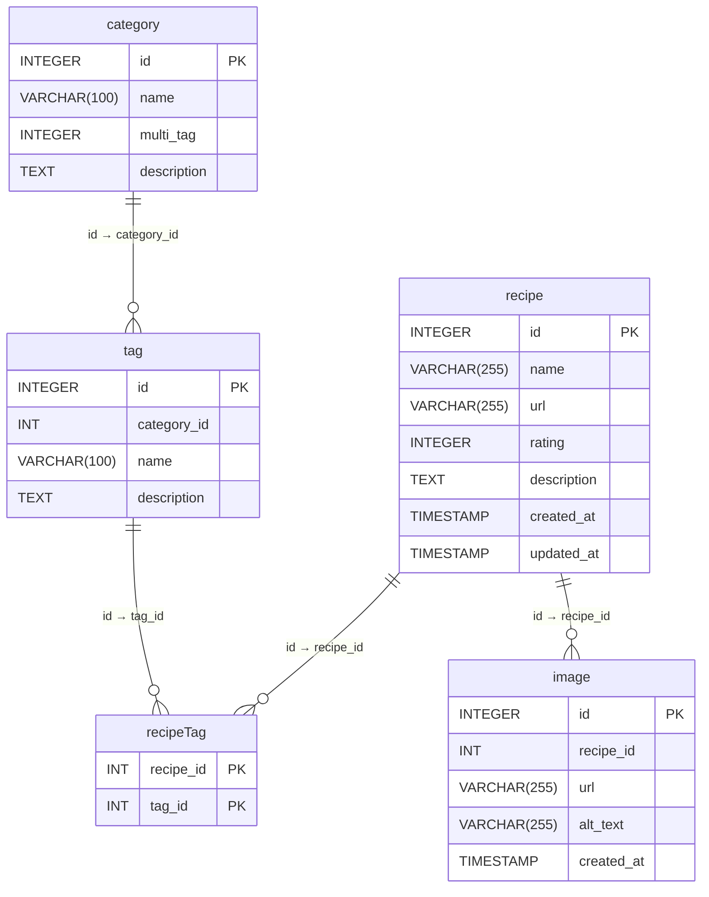

```mermaid
erDiagram
    category {
        INTEGER id PK
        VARCHAR(100) name
        INTEGER multi_tag
        TEXT description
    }
    image {
        INTEGER id PK
        INT recipe_id
        VARCHAR(255) url
        VARCHAR(255) alt_text
        TIMESTAMP created_at
    }
    recipe {
        INTEGER id PK
        VARCHAR(255) name
        VARCHAR(255) url
        INTEGER rating
        TEXT description
        TIMESTAMP created_at
        TIMESTAMP updated_at
    }
    recipeTag {
        INT recipe_id PK
        INT tag_id PK
    }
    tag {
        INTEGER id PK
        INT category_id
        VARCHAR(100) name
        TEXT description
    }

    recipe ||--o{ image : "id → recipe_id"
    tag ||--o{ recipeTag : "id → tag_id"
    recipe ||--o{ recipeTag : "id → recipe_id"
    category ||--o{ tag : "id → category_id"
```